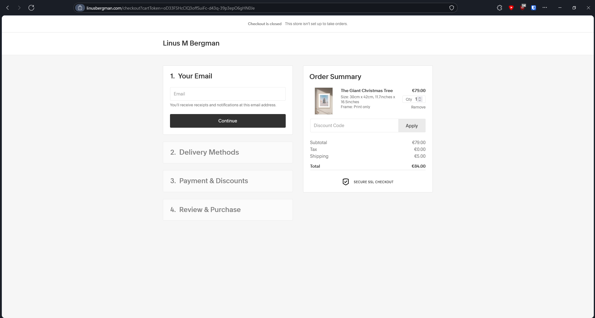
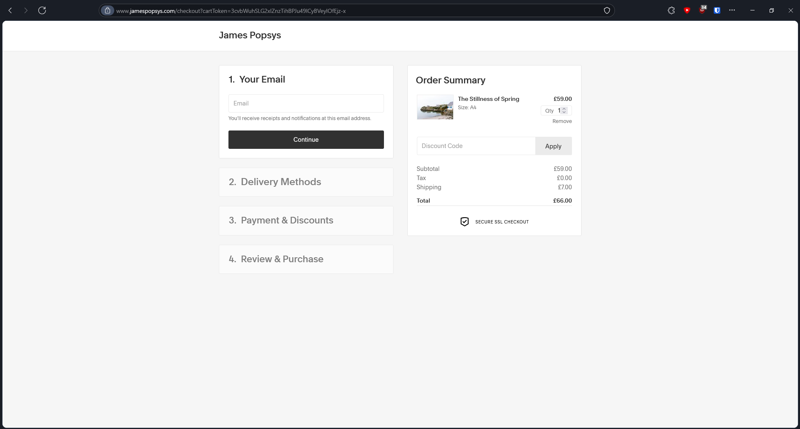
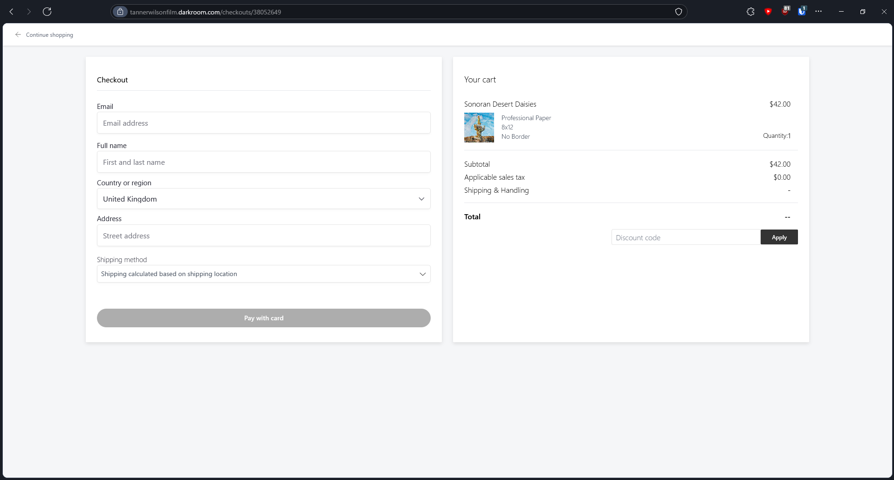
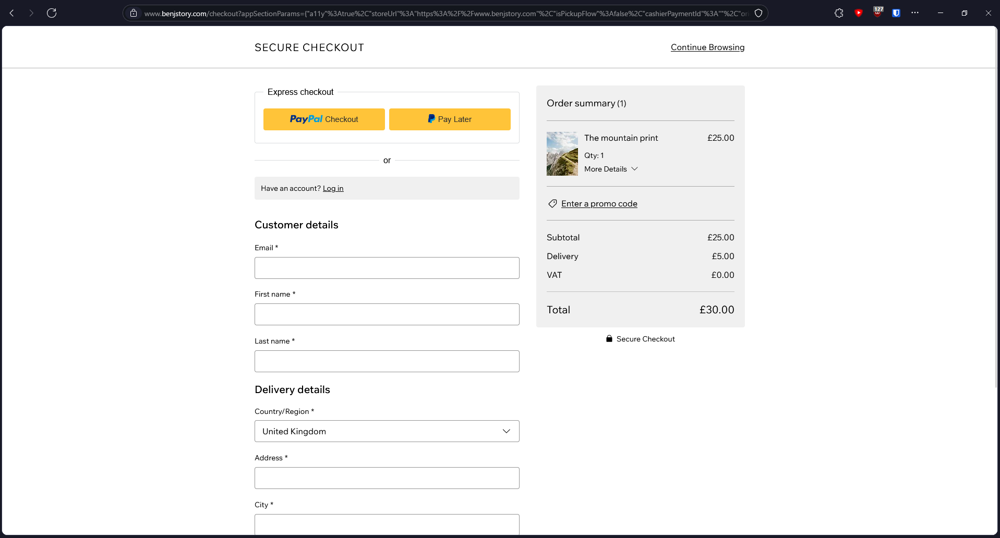

# Checkout pages

## Finding inspiration

A part of creating this website has been decing how things should look.
Inspiration often comes from other photographers websites, as I have never created a checkout page or things as such.
In looking for what one should look like, I looked at Linus Bergmans site. His product page was the inspiration for mine so, I thought the checkout page would be to.
It wasn't.
Boring, bland, grey.

So I looked elsewhere, the first photographer that came to mind was James Popsys, so I looked there.

Almost the exact same. It must be Squarespaces default, or only, checkout.

I now had to find a photographer that wasn't using squarespace, a task easier said than done.

Tanner Wilson was using darkroom, a print store as a service, where you simply sign up and upload your images, and they print and fulfil orders for a cut.
The wix checkout is just as bland. Perhaps thats the essence of a checkout. Bland and wholy functional.

For now, I have to find someone not using a web builder or saas.
