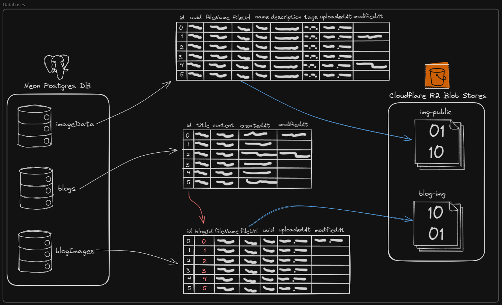
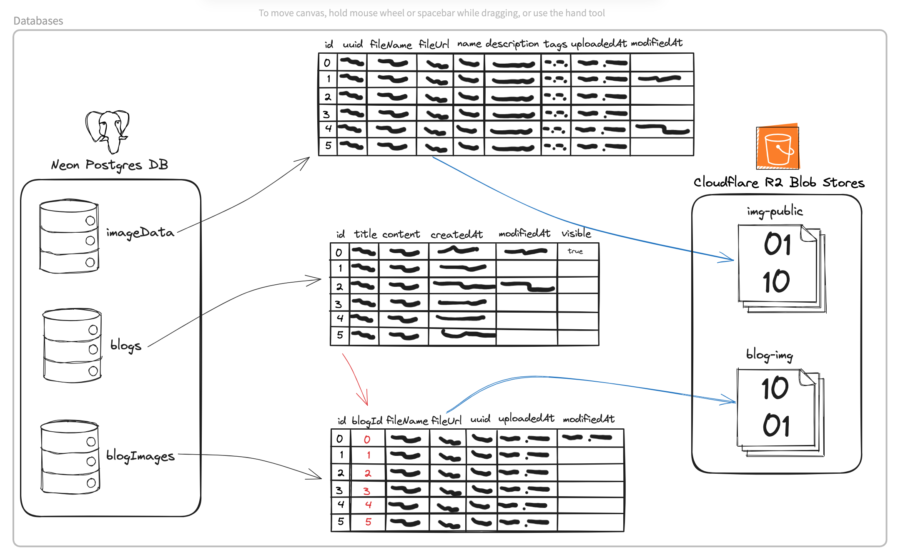

# Commits

## This doc will contain all the commits made to the project. It will be updated every time a new commit is made

## 🎉 Create initial project files

This commit contains the initial project files. It is the starting point of the project.

[Link](https://github.com/theomiddleton/portfolio-project/commit/c915347fbbf0e3e7e10a26a0903a5b9ce899c053)

## 🚧 Create a simple landing page, and add shadcn/ui, tailwind, and more

This commit contains the creation of a simple landing page, it uses shadcn/ui, and tailwind, so they have been added to the project. Radix UI has also been added to the project as a dev dependency of shadcn/ui, and for some icons.

[Link](https://github.com/theomiddleton/portfolio-project/commit/8b6e7ddec8a36b5f4a4ae7f525e519b121ef90f4)

## 🚧 Start on file upload and start commit documentation

This commit contains the start of the file upload feature, and the start of the this, the commit documentation. The admin page is simply the ui for now, with the functionality to be added later.

[Link](https://github.com/theomiddleton/portfolio-project/commit/d9eb6947b0de1ab61156455bd2a9722c6f206961)

## ✨ Add image upload to a cloudflare R2 bucket

This commit adds uploading images to a cloudflare R2 bucket. It does this through the aws sdk, as that is how you interface with a cloudflare R2 bucket as per the cloudflare documentation.

[Link](https://github.com/theomiddleton/portfolio-project/commit/92321d991622563c74aab7cc66200915e55f0bd7)

## 🗃️ Add database and image data schema

This commit adds the database libraries, for the database I am using planetscale, so I can host it online. The database is MySQL, and I am using drizzle to interface with it, drizzle is an orm for MySQL, and other databases, but I am only using it for MySQL. The image data schema is also added, this is the schema for the image data, which is things like the file URL, the file name, when it was uploaded and more.

[Link](https://github.com/theomiddleton/portfolio-project/commit/29d2e8dd939e002c3d28b4a77f1a9b263b39ecf0)

## 🗃️ Add full delete and uploading image data to the database

This commit adds the full delete functionality, and the uploading of the image data to the database. The full delete functionality is the ability to delete the image from the cloudflare R2 bucket, and the database. The image data is uploaded to the database, and the file URL is also uploaded to the database.

[Link](https://github.com/theomiddleton/portfolio-project/commit/e52be60c283ab3bd446c650ba34ade9a38ebc2be)

## 🎉 Fetch ImageUrls from DB, and start on main image gallery

This is a larger commit than most before. It adds the working fetching of ImageUrls and ImageData from the database, meaning, now images can be seen without hardcoding their URLs.

This allowed me to add a image carousel to the admin page, allowing for the preview of all images with their data stored in the database. In adding this carousel, I refactored the admin page, making the UI more inline with the rest of the design language, and adding the ability to add more data to the images, allowing for image titles, tags, and descriptions.

Since I could now fetch imageData, it allowed me to start on the main image gallery, which is simpler to create than I originally thought with the help of the tailwind class 'columns' in the layout section. This allows the images to be added to a gallery, while preserving their original aspect ratio.
The code:

```tsx
<section className="columns-4 max-h-5xl mx-auto space-y-4">
  {imageUrls.map((url) => (
    <div key={url} className="rounded-md overflow-hidden hover:scale-[0.97] duration-100">
      <a href={url} target="_blank" rel="noreferrer">
        
      </a>
    </div>
  ))}
</section>
```

The first line is what makes the gallery work. the `columns-4` creates 4 columns of images, `space-y-4` creates a gap of 16px vertically between images.
The second line is what assigns the imageUrl map, basically an array of the imageUrls fetched from the db, to the `` tag, making it render on the page.
The `<div>` is currently only used to slightly scale down the image when hovered, to create a little intractability in the gallery.
The `<a>` Is for when the image is clicked. currently it directs to the imageUrl, but with will change in the future, either linking to a page showing the image with its title, description and tags; or linking to its store page allowing for the purchase of the print.
Finaly, the `` tag is what shows the actual image. The url is the current url selected from the imageUrls map, a map in javascript being an object holding key value pairs, in the original insertion order. The map remembering the original insertion order is important, as it would allow for the custom order of images in the future.

Fetching ImageUrls from the database is done with this function

```ts
  const result = await db.select({
    id: imageData.id,
    fileUrl: imageData.fileUrl,
  }).from(imageData)
  const imageUrls = result.map((item) => item.fileUrl)
```

For the image map it only fetches the Id and fileUrl currently, as the gallery only shows the images, metadata, tags, titles, and description would only need to be fetched for the image page, where those things are shown.
The function works as follows, result is a json array fetched straight from the db, and is in the form

```js
[
  {
    id: 1,
    fileUrl: 'https://img.theomiddleton.me/03ea4dc1-4239-4fbf-897e-5d32d603e2b1.jpg'
  },
  {
    id: 2,
    fileUrl: 'https://img.theomiddleton.me/34081e3c-af18-4c0d-b324-44a01a907af7.jpg'
  },
  {
    id: 3,
    fileUrl: 'https://img.theomiddleton.me/e40c05e3-137d-4fc9-a928-ea18d0409eea.jpg'
  },
  {
    id: 4,
    fileUrl: 'https://img.theomiddleton.me/3b63345e-b5f0-4aba-b9f1-08d5a64690d3.jpg'
  },
  {
    id: 5,
    fileUrl: 'https://img.theomiddleton.me/5064ac81-091c-46ee-913c-e19e64a1beb9.jpg'
  },
  {
    id: 6,
    fileUrl: 'https://img.theomiddleton.me/3f21027e-5b4a-456c-b517-9f6614f05815.jpg'
  },
  {
    id: 7,
    fileUrl: 'https://img.theomiddleton.me/921d85de-c6e4-4ff7-96e0-6add158a37ed.jpg'
  }
]
```

The result is then put into a map object and takes the form:

```js
[
  'https://img.theomiddleton.me/03ea4dc1-4239-4fbf-897e-5d32d603e2b1.jpg',
  'https://img.theomiddleton.me/34081e3c-af18-4c0d-b324-44a01a907af7.jpg',
  'https://img.theomiddleton.me/e40c05e3-137d-4fc9-a928-ea18d0409eea.jpg',
  'https://img.theomiddleton.me/3b63345e-b5f0-4aba-b9f1-08d5a64690d3.jpg',
  'https://img.theomiddleton.me/5064ac81-091c-46ee-913c-e19e64a1beb9.jpg',
  'https://img.theomiddleton.me/3f21027e-5b4a-456c-b517-9f6614f05815.jpg',
  'https://img.theomiddleton.me/921d85de-c6e4-4ff7-96e0-6add158a37ed.jpg'
]
```

By making it only the urls, it is easier to parse for displaying the images, as shown before; However, there is the ability to include the Id in the key value pair for custom image ordering.

[Link](https://github.com/theomiddleton/portfolio-project/commit/36c7af846e4feb1c538d18e157f99c86281d9dd7)

## 🎉 Add image page

### Image pages

A vital part of this project is the viewing of images. This commit adds the dynamic routes for images. The dynamic routes are created in the file structure:

```text
├── src
│   ├── app
│   │   ├── photo
│   │   │   ├── [id]
│   │   │   │   ├── page.tsx
```

it is the `[id]` section that creates the dynamic route, and the `page.tsx` is the page that renders. I used `[id]` as the images already had id's assosiated associated with them in the database, so it made sense to do it that way.

Within some of the code in `page.tsx` is as follows:

```tsx
export default async function Photo({ params }: { params: { id: number } }) {

  const result = await db.select({
      id: imageData.id,
      fileUrl: imageData.fileUrl,
      name: imageData.name,
      description: imageData.description,
      tags: imageData.tags,
      uploadedAt: imageData.uploadedAt
  }).from(imageData).where(eq(imageData.id, params.id))

  const imageUrl = result.map((item) => item.fileUrl)
```

The code shown is broken down as such:

`export default function` is used in every next route, it is used to export the page for rendering `async` declares it as asynchronous so await functions can be used for fetching from the database, and then `Photo()` is for the name of the page.

Within `Photo` params are passed, `Photo({ params }` a vital part of dynamic routes, allowing the route to access the id of the page that is active, tellind the page whether the user is on `photo/1`, `photo/2`, `photo/3`, or `photo/4`. The part following `: { params: { id: number } }` is a typescript declaration ensuring only ids of the type number can be accessed or passed, avoiding errors in the future.

The next part fetches data from the database. `const result = await db.select` assigns all returned data to the constant result, with `await` ensuring data will only be assigned when it has been fetched.

Since this is the image page, almost all stored info is fetched, as unlike the main page, the title, description, and tags are displayed.

Finaly the imageUrls are assigned to a map as discussed in the previous [commit](#🎉-fetch-imageurls-from-db-and-start-on-main-image-gallery)

### Changes to the main gallery

Since image pages have been created now, they should be accessable via the main gallery by clicking on the image.
To do this, the `<a href>` must be changed to the image page.

This means the image id must now be loaded along side the imageUrls. To do this, the code was changed as follows:

```tsx
const imageUrls = result.map((item) => ({
  id: item.id,
  url: item.fileUrl
}))
```

The assignment is changed so urls and ids are held within the array, giving access to the url and its id for directing to the image page.

```tsx
<section className="sm:columns-1 md:columns-2 lg:columns-3 xl:columns-4 max-h-5xl mx-auto space-y-4">
  {imageUrls.map((image) => (
    <div key={image.id} className="rounded-md overflow-hidden hover:scale-[0.97] duration-100">
      <a href={'/photo/' + image.id} target="_self" rel="noreferrer">
        <Image src={image.url} alt="img" height={600} width={400} />
      </a>
    </div>
  ))}
</section>
```

This code hasn't changed much, but the `href` now directs to the image page, done so by concatenating the string `/photo/` + the image id.

### Issues

Something I noticed while building this part of the project, is when running the project through the dev server, all images are desaturated and rather grey.

After doing some research this appears to be due to the different colour spaces of the images. Many of the images I am using for testing are exported in colour spaces such as Adobe RGB or ProPhoto RGB. Since images for the web should only be in narrower gamut colour spaces such as sRGB or REC.709A for video, the colour space transform was desaturating the image. Further in the research I found that this only occurs on the devopment server, and not on any builds.

### Moving forward

The plan for the next features will be authentication and all its complexities. Auth is more than just a login page, needing token based session management and a roust login system.
For the type of website it is, email and password auth should be used as this will allow us to use the auth components for the print store later.
For email and password auth, you need an email handler and to hash and store hashed passwords. For the hashing a crypto algorithm must be used, and for the emails, something like resend could be used.
If we already have accounts and emails, a newsletter or other emails could be sent from within the app by the admin

## 🎉 Add Authentication and signin / register pages

Authentication is a major part of this project. Without it, anyone would be able to upload images to the blob store, and to the database. That would be a massive security issue, so auth is needed.

### What I used

There are many different authentication providers avalible, clerk, next auth, auth0, lucia auth, and more. for now, I chose kinde auth. There isnt a specific reason I chose them, but the sdk drops in well with my current codebase, and it wont be hard to migrate away from then in the future if needed. So far login is only needed for access to the admin page, but as I implement the store in more, it will be needed for many users.

The I made the signin similar to the upload page, a shadcn/ui card with form elements and styled with tailwind. Since it is in card form, I can easily move it to a component, so it is accessable on all pages.

I am a strong beliver in the useablility and speed of social sign on, or sso for short. Its those sign in with google, facebook, microsoft buttons you see, and therefore I chose to use them. For the auth providers I added, I decided based on what I would personaly use, github, which I use for most dev tools, discord, a ever growing social platform, and microsoft, since I primarily use their email.

Kinde has components within their sdk for sso, so I used unstyled versions of them as such:

```tsx
<LoginLink className="bg-primary...."
    authUrlParams={{
        connection_id: 'conn_1d769022b0874cb3bbe66f5ff612dece'
    }}>
    <Icons.gitHub className="flex align-middle justify-center w-5 h-5 pr-1"/>
    Sign In With GitHub
</LoginLink>
```

This code is an example of the github sso button, The className has been shortened, as to style it along with other shadcn/ui buttons, the className is over 300 characters long. It also holds an svg icon within the button for better ux.

There is also a currently unconnected email and password signin form, which I will finish at a later date.

### Authenticating pages

All this is currently only for the admin page, where `useKindeBrowserClient()` is imported, This is what allows us to see if the user is authenticated.

The following lines initialise this, and return a loading message while fetching the users login state and comparing that to the users

```tsx
const { isAuthenticated, isLoading } = useKindeBrowserClient()
if (isLoading) return <div>Loading...</div>
```

Then, if the user is authenticated, the normal page is shown, otherwise a simple message is shown

```tsx
return isAuthenticated ? (
  //Normal page goes here
  ) : (
    <div>
      Sorry, But you dont have the permissions to view this page!
    </div>
```

<https://excalidraw.com/#json=NusT72QrRy-Ww7xZ6-YiS,hLkDc-7xOCMCl9xMeIkbdA>

## 🎉 Add blog writing and blog pages, analytics, and cloudflare pages

This commit added blog writing and displaying to the website. The blog writing page has a section for writing the content in markdown, and a section next to that for viewing the markdown rendered correctly. There is then a form for uploading images, which, when correctly uploaded, will add the markdown verion of the link ``

The blog page is a simple page that displays all the blogs in the database, displayed in their title form, then when clicked on, points to a dynamic page with the full blog post.

The database has two tables for blogs, one for the blog itself, with rows for the title, content, and date. I will discuss later how this is an issue and another row had to be added.
The second table is for the blog images, with a similar structure to imageData, but without the title and tags, with a blogId row added, to link the image to the blog, but this causes issues.

### currrent issues

This commit added the writing and displaying of blogs. Images are often a vital part of blogs, whether it be a header image or for added context, but, in this commit, the database has two tables for blogs


The issue with this comes when one tries to upload an image while writing a blog. The image needs the BlogId, but the blog hasn't been uploaded yet.

### Solution

There are various ways of fixing this, but the one I chose was to upload the blog first, then upload the image. This way, the blogId is known and can be assigned to the image. This however is not the best solution, as it means the unfinished blog will be visible to the public, but the image will not yet ne attached to it. Therefore I will add a flag to the blog table, which will be set to false until the blog is finished, and give the writer an option to publish the blog.

This also means that draft posts can be written and saved, and published at a later date. To do this however, I will need to change the ui to allow for this, and add functionality needed for drafts.


